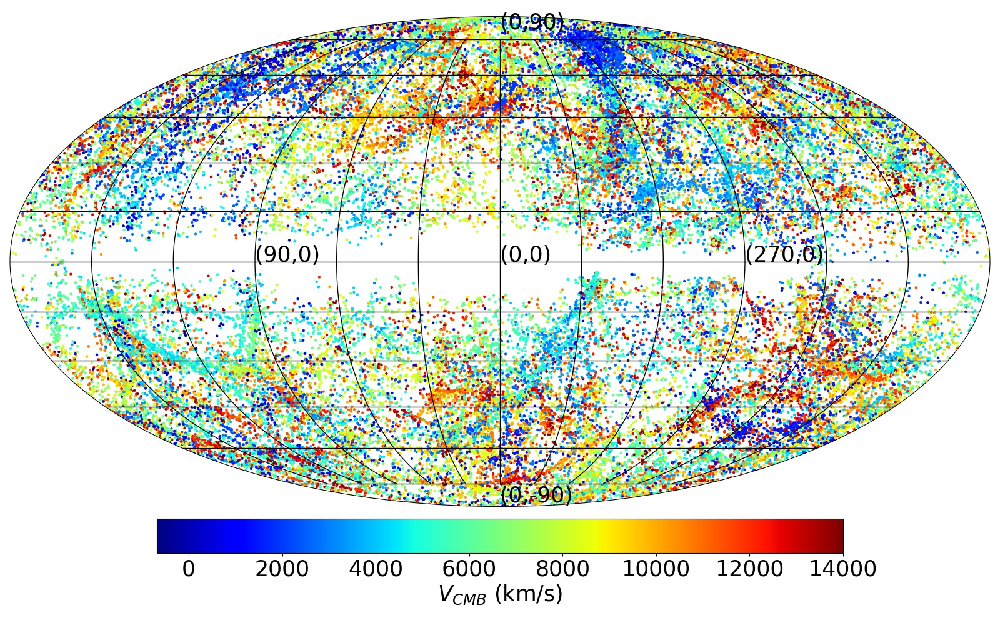

# Plotting Mollweide distribution of data with spherical coordinates
Using Matplotlib, NumPy, and Pandas

You can use this Python script for plotting Mollweide distribution of data with spherical coordinates (in degrees). 

In particular, it can quickly and simply be used for plotting the all-sky distribution of any astronomical data. 
Your data file should be tab-separated with the longitude and latitude coordinates being the first and the second column, respectively, and the third column to be a quantity you need to color code.

An example data file "galactic.txt" is also provided in this repository. 

When running the script you will be asked to provide "The path to the input data file", "Name of the output image file", "Label of the third column for the colorbar", and ""A valid matplotlib cmap". An example of the output image is shown below.

